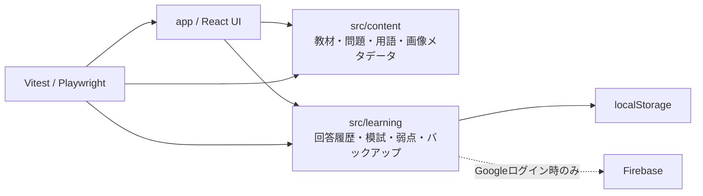

# 基本情報技術者 合格ナビ

[](https://github.com/misaka310/fe-study/actions/workflows/ci.yml)


基本情報技術者試験（FE）の科目A・科目Bを、**教材 → 問題演習 → 弱点復習 → 模擬試験**まで一つのWebアプリで学べる日本語学習サイトです。

12章の教材と合計 **465問**（通常問題305問＋科目A基本問題160問）を収録し、回答履歴・分野別成績・弱点をブラウザ内に保存します。Googleログインは任意で、有効化した環境では学習履歴をFirebaseへ同期できます。

> **非公式教材です。** 情報処理推進機構（IPA）による承認・後援・提供を受けたものではありません。掲載する第三者の名称・商標・公式資料は各権利者に帰属します。サイト内の正答率は学習上の目安であり、公式のIRT評価点は再現しません。

## プロジェクトの特徴

- **科目A・科目Bを一体化** — 教材、通常問題、基本問題、模試、弱点復習を同じ学習状態で扱います。
- **465問をデータとして検証** — 問題ID、選択肢、正答、解説、分野、問題数、解説画像との対応を自動テストで確認します。
- **「なぜ他の選択肢が違うか」まで説明** — 正答だけでなく、各選択肢を外す理由を保持します。
- **local-first** — 未ログインでも学習履歴は `localStorage` に保存され、JSONでバックアップ・復元できます。
- **任意のクラウド同期** — Firebase設定がある環境では、Googleログイン後だけ利用者別領域へ学習履歴を同期します。
- **ブラウザ導線をE2E検証** — 教材の章切替、URL履歴、戻る／進む、問題演習、模試、レスポンシブ表示をPlaywrightで確認します。
- **公式問題の転載を避ける** — IPA公開問題そのものは収録せず、公式ページへのリンクと独自作成問題で構成します。

## 技術スタック

| 領域 | 技術 |
| --- | --- |
| UI | React 19 / Next.js 16互換構成 / TypeScript |
| Build | Vinext / Vite |
| Styling | CSS / Tailwind CSS toolchain |
| Local persistence | Web Storage (`localStorage`) |
| Optional sync | Firebase Authentication / Firestore |
| Unit & integration tests | Vitest / Testing Library |
| E2E | Playwright |
| Hosting | ChatGPT Sites互換ビルド構成 |

## 主な機能

- 12章の教材で、基礎理論から科目Bの擬似言語・セキュリティ事例まで学習
- 独自の通常問題 **305問**（科目A 165問・科目B 140問）
- 科目Aの基本問題 **160問（20問×8セット）**
- 全科目465問・科目A325問・科目B140問を切り替える問題演習
- 科目Bを基礎100問 / 本番レベル40問で切り替え
- 未回答・誤答・弱点優先・分野別の演習
- 科目A **60問 / 90分**、科目B **20問 / 100分**の模擬試験
- 全465問に対応するWebP解説図
- TTL、DNS、TCP、UDPなどの略語・専門語を確認できる用語チップ
- 学習履歴・正答率・分野別成績・弱点ランキング
- JSONバックアップ / 復元
- 任意のGoogleログイン / Firebase同期
- IPAのシラバス、試験要綱、公開問題への公式リンク

## ローカルで起動

### 必要環境

- Node.js 22.13以上
- npm

```bash
git clone https://github.com/misaka310/fe-study.git
cd fe-study
npm ci
npm run dev
```

ブラウザで `http://localhost:3000` を開きます。

Firebase設定を行わなくても、教材・問題演習・模試・学習履歴のローカル保存は利用できます。Google同期を有効化する場合だけ `FE_FIREBASE_CONFIG_JSON` または `FE_FIREBASE_CONFIG_URL` を設定します。詳細は [`docs/DEPLOYMENT.md`](./docs/DEPLOYMENT.md) を参照してください。

## 品質確認

通常の変更は次の4項目を通すことを基準にしています。

```bash
npm run lint
npm test
npm run typecheck
npm run build
```

ブラウザ導線を変更した場合は、追加で次を実行します。

```bash
npx playwright install chromium
npm run test:e2e
```

テスト対象や品質基準の詳細は [docs/QUALITY.md](./docs/QUALITY.md) にまとめています。

## アーキテクチャ



教材・問題・正答・解説・学習状態を分離し、問題数や表示件数は正本データから算出します。詳しくは [docs/ARCHITECTURE.md](./docs/ARCHITECTURE.md) を参照してください。

## データとプライバシー

未ログイン時の学習履歴は利用中のブラウザの `localStorage` に保存します。ブラウザのサイトデータを削除すると履歴も削除されるため、必要に応じてJSONバックアップを利用してください。

Firebase設定が存在する環境で利用者がGoogleログインを選んだ場合だけ、学習履歴を利用者別のFirestore領域へ同期します。外部解析サービスは使用しません。

## リポジトリ構成

- `app/` — ページ構成と全体スタイル
- `src/components/` — 教材、問題演習、模試、学習記録などのUI
- `src/content/materials/` — 12章の教材
- `src/content/questions/` — 独自問題
- `src/content/basic/` — 科目A基本問題
- `src/learning/` — 学習状態、保存、同期、バックアップ
- `public/images/` — 教材図・問題解説図
- `tests/` — 単体・統合・E2Eテスト
- `docs/SPEC.md` — ユーザー向け仕様の正本
- `docs/ARCHITECTURE.md` — 実装構成
- `docs/QUALITY.md` — 品質保証と検証範囲
- `docs/QUESTION_AUTHORING.md` — 問題作成・レビュー基準

開発ルールは [CONTRIBUTING.md](./CONTRIBUTING.md) を参照してください。

## 教材構成

1. 合格ロードマップ
2. 基礎理論・情報表現
3. コンピュータ構成要素
4. OS・ソフトウェア
5. データ構造とアルゴリズム
6. データベース
7. ネットワーク
8. 情報セキュリティ
9. システム開発・設計
10. マネジメント
11. ストラテジ・企業活動
12. 科目B攻略・直前確認

## 公式情報

- [IPA 試験要綱・シラバス](https://www.ipa.go.jp/shiken/syllabus/gaiyou.html)
- [IPA SG・FE公開問題一覧](https://www.ipa.go.jp/shiken/mondai-kaiotu/sg_fe/koukai/index.html)
- [IPA 2026年度FE公開問題](https://www.ipa.go.jp/shiken/mondai-kaiotu/sg_fe/koukai/2026r08.html)
- [IPA 2027年度以降の試験制度見直し](https://www.ipa.go.jp/shiken/syllabus/henkou/2025/20260331.html)

## ライセンス

このリポジトリで独自に作成したコードと文書は [MIT License](./LICENSE) で提供します。第三者の名称・商標・公式資料へのリンクなど、本リポジトリが権利を持たないものには、それぞれの権利者の条件が適用されます。
