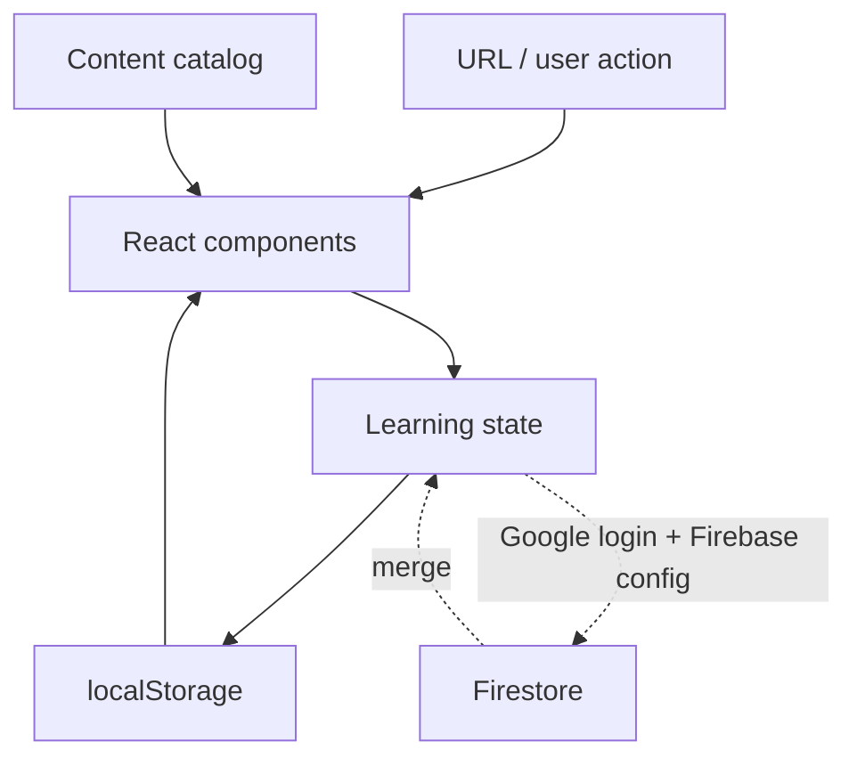

# Architecture

## 概要

基本情報技術者 合格ナビは、教材・問題・用語・学習状態を分離したブラウザ中心の学習アプリです。学習履歴は `localStorage` を正本とするlocal-first設計で、Firebase設定がある環境で利用者がGoogleログインを選んだ場合だけクラウド同期します。

## 主な領域

### `app/`

ページの入口、共通レイアウト、全体スタイルを担当します。クエリパラメータから教材・問題演習・模試・学習記録の各画面を選択します。

### `src/components/`

教材リーダー、問題演習、模試、学習記録、用語チップ、説明図、任意のGoogle同期UIを担当します。コンポーネントは表示とユーザー操作に集中し、教材や問題そのものは `src/content/` から受け取ります。

### `src/content/`

教材、問題、用語、公式リンク、説明図メタデータの正本です。

- `materials/` — 12章の教材
- `questions/` — 科目A・科目Bの独自問題
- `basic/` — 科目A基本問題
- `glossary.ts` — 略語・専門語の説明
- `visuals.ts` — 教材説明図のメタデータ
- `explanationVisuals.ts` — 問題解説図のメタデータと先読み情報
- `vocabulary.ts` — 基本問題の統合入口

問題数などデータから導出できる表示値は、この正本データから算出します。

### `src/learning/`

回答履歴、弱点集計、模試セッション、保存、バックアップを担当します。

- `storage.ts` — `localStorage` への保存・復元
- `state.ts` — 学習状態の更新
- `practiceSession.ts` — 問題演習セッション
- `backup.ts` — JSON書き出し・復元
- `merge.ts` — ローカル状態とクラウド状態のマージ

### `tests/`

Vitest / Testing Libraryでデータ不変条件とコンポーネント挙動を、Playwrightで主要なブラウザ導線を検証します。教材の章切替は、本文・URL・スクロール位置・ブラウザ履歴を一つのUX契約として確認します。

## 主要データフロー

1. `app/page.tsx` がURLのクエリを読み、表示する主要画面を選びます。
2. 各画面は `src/content/` の教材・問題・用語データを参照します。
3. 回答や模試操作は `src/learning/` の学習状態へ反映します。
4. 学習状態は常に `localStorage` へ保存します。
5. Firebase設定があり、利用者がGoogleログインした場合だけ、ローカル状態とFirestoreの利用者別状態をマージして同期します。
6. 学習記録画面は蓄積した回答から正答率や弱点を算出します。

## 設計上の境界

- IPA公開問題の本文は収録せず、公式情報へのリンクだけを掲載します。
- Firebase同期は任意機能です。設定が無い環境でも主要な学習機能・テスト・buildを成立させます。
- 外部解析サービスは使用しません。
- 問題IDと学習履歴の互換性を維持します。
- 教材画像は装飾目的ではなく、本文理解を補助できる内容だけを採用します。
- 問題解説図は `public/images/explanations/` のWebPを使い、表示中の問題と次の問題の画像を先読みします。
- ユーザー向け仕様の正本は [`SPEC.md`](./SPEC.md) です。
- 品質保証の範囲は [`QUALITY.md`](./QUALITY.md) にまとめます。
